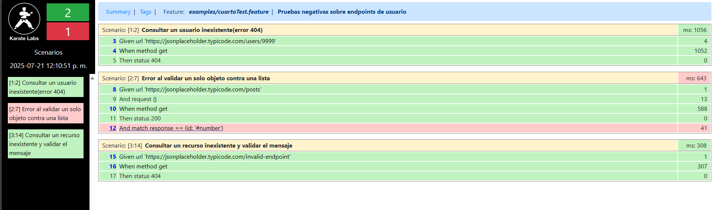
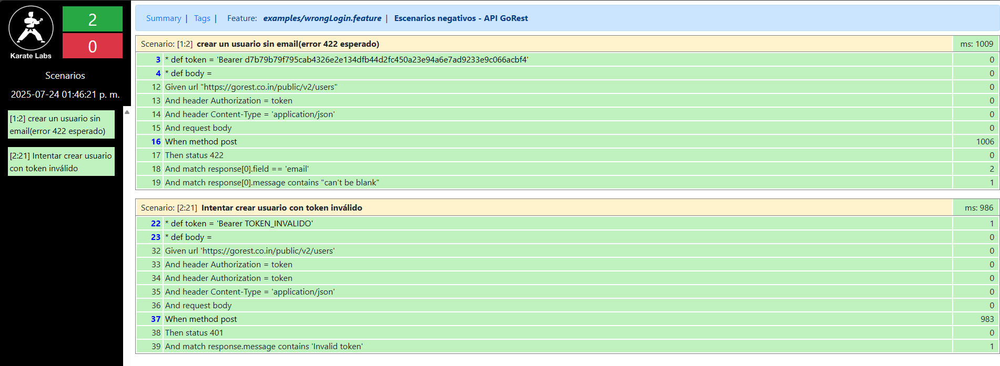
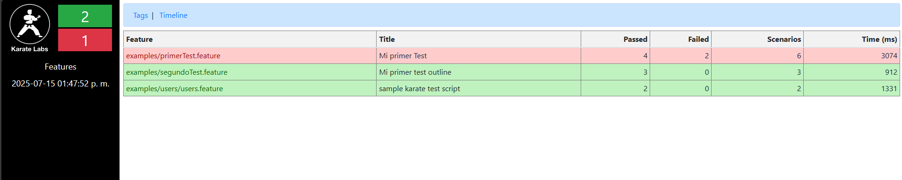

# 🧪 Karate API Tests – Portafolio QA

Este repositorio contiene un conjunto de pruebas automatizadas de API utilizando [Karate DSL](https://github.com/karatelabs/karate), como parte de mi formación y experiencia como **QA Automation Engineer**.

> 🔍 Este proyecto forma parte de mi portafolio profesional y está orientado a demostrar el uso práctico de pruebas `GET`, `POST`, `PUT`, `DELETE`, validación de estructuras JSON, manejo de datos externos y reportes HTML de ejecución.

---

## 📦 Tecnologías utilizadas

- ✅ [Karate DSL](https://github.com/karatelabs/karate)
- ✅ Maven
- ✅ JUnit5
- ✅ IntelliJ IDEA
- ✅ GitHub Actions (próximamente)
- ✅ JSON Placeholder como API simulada

---

## 📁 Estructura del proyecto
```text
karate-api-tests/
├── src/test/java/examples/
│   ├── primerTest.feature         # Escenarios de prueba principales
    ├── segundoTest.feature        # Escenarios de prueba principales
    ├── tercertTest.feature        # Escenarios de prueba principales
│   ├── users/users.feature        # (Opcional) Casos separados por módulo
│   ├── data/nuevo-post.json       # JSON externo reutilizable
│   └── ExamplesTest.java          # Runner para ejecución con JUnit5
├── karate-config.js               # Configuración global (por entorno)
├── logback-test.xml               # Configuración de logs
├── pom.xml                        # Configuración de Maven
└── README.md                      # Este archivo
```


---

## 🧪 Escenarios implementados

### ✔️ CRUD básico sobre `/posts`
- `GET /posts/{id}` → Obtener usuario
- `POST /posts` → Crear post inline y desde archivo externo
- `PUT /posts/{id}` → Actualizar post existente
- `DELETE /posts/{id}` → Eliminar post simulado

### ✔️ Validaciones y prácticas
- Uso de `Background` para eliminar repetición de código
- Uso de `Scenario Outline` para pruebas con múltiples datos
- Validaciones con `match`, `match contains`, `match each`
- `match contains any` → Permite que al menos uno de varios valores exista.
- `match contains only` → Verifica que solo existan los valores definidos.
- `match each` → Aplica una validación a cada objeto de un array.
- `match each contains` → Valida que cada objeto tenga al menos los campos definidos, ignorando el resto.
- Generación de reportes HTML post-ejecución


### 🧪 Validaciones flexibles con `match contains`
Karate permite validar parcialmente objetos complejos ignorando campos extra.  
Por ejemplo:

```karate
* def expectedUser =
"""
{
id: '#number',
name: '#string',
username: '#string',
email: '#string',
address: {
street: '#string',
city: '#string'
}
}
"""
Given url 'https://jsonplaceholder.typicode.com/users'
When method get
Then status 200
And match each response contains expectedUser
```
📌 Esto valida que cada usuario tenga al menos los campos definidos, ignorando el resto (como zipcode, company, etc).

### 🚫 Escenario negativo por estructura incorrecta
```karate

Scenario: Error al validar un solo objeto contra una lista
Given url 'https://jsonplaceholder.typicode.com/posts'
When method get
Then status 200
And match response == { id: '#number' }
```
⚠️ Este test falla porque el endpoint /posts retorna un arreglo (lista de objetos), no un solo objeto.
El error ayuda a entender la diferencia entre:

- match response == { ... } (espera un objeto),

- match each response contains { ... } (espera una lista de objetos).



### 🚫 Validaciones negativas (Errores 401 y 422)
Karate permite validar respuestas de error con facilidad, útil para escenarios donde los datos no son válidos o las crededenciales son incorrectas.

### Escenario de datos incorrectos (422)
```karate

* def body =
"""
{
name: 'Elohim QA',
gender: 'male',
status: 'active',
email: 'qainvalido@gmail.com'
}
"""
Given url "https://gorest.co.in/public/v2/users"
And header Authorization = token
And header Content-Type = 'application/json'
And request body
When method post
Then status 422
And match response[0].field == 'email'
And match response[0].message contains "can't be blank"
```
### Escenario de token invalido (401)
```karate
* def token = 'Bearer TOKEN_INVALIDO'
* def body =
  """
  {
  name: 'Elohim QA',
  gender: 'male',
  status: 'active',
  email: 'qainvalido@gmail.com'
  }
  """
  Given url 'https://gorest.co.in/public/v2/users'
  And header Authorization = token
  And header Authorization = token
  And header Content-Type = 'application/json'
  And request body
  When method post
  Then status 401
  And match response.message contains 'Invalid token'
```
#### Evidencia de resultados


## ▶️ Cómo ejecutar las pruebas

Asegúrate de tener Maven instalado. Luego ejecuta:

```bash
mvn test
```

## 📸 Evidencia de ejecución

Después de ejecutar `mvn test`, se genera un reporte HTML:

📍 Ubicación: `target/karate-reports/karate-summary.html`

### 🟢 Reporte generado por Karate DSL:



## 🤝 Cómo contribuir

1. Haz un fork del proyecto
2. Crea tu rama: `git checkout -b mi-feature`
3. Haz commit de tus cambios: `git commit -m 'Agrego nueva validación'`
4. Sube tu rama: `git push origin mi-feature`
5. Abre un Pull Request
---
También puedes abrir issues si detectas errores o mejoras.

## 👨‍💻 Autor

**Elohim Aguilar**  
QA Lead | Automatización de APIs | Testing de microservicios  
📫 [LinkedIn](https://linkedin.com/in/TU_USUARIO)  
💻 [GitHub](https://github.com/TU_USUARIO)

> “Automatizar no es solo ejecutar rápido, es validar con inteligencia.” 🧠

## 📄 Licencia

Este proyecto es de uso libre para fines educativos y de portafolio profesional.  
No contiene datos privados ni APIs propietarias.

